  

# 🌌 Hi, there~

> Vision is the foundation of how we perceive the world, while art shapes the soul of culture.

I am currently a graduate student in the field of Artificial Intelligence, with strong interests in diffusion models, world models, efficient inference, and AI agent development.
I am passionate about making AI not only more powerful, but also more aligned and accessible in everyday life.

# 🍪 About Me

Graduate student in AI/CS, with both undergraduate and graduate studies completed at top-tier universities in China, currently I am in my internship in @ModelTC for further study.

- My interests focus on diffusion models, world models, efficient inference, and AI agent (test-time training)
- Former Research Assistant with hands-on research experience
- I regularly write articles on [Blog](https://reychiaro.github.io) and [Zhihu](https://www.zhihu.com/people/chiaroair)
- Reach me with **chiaroair@gmail.com**

<h3 align="left">Languages and Tools:</h3>

      

Beyond work and coding, I am also a beginner photographer and cosplayer. While exploring the real world, I am also passionate about anime. I like reading and taking walks when I'm taking a break. Skiing is a new hobby I've learned recently. 

I believe that even though AI can offer us a lot of help, such as generating exquisite pictures, videos and even virtual worlds, real wisdom and natural art are still worth experiencing.

